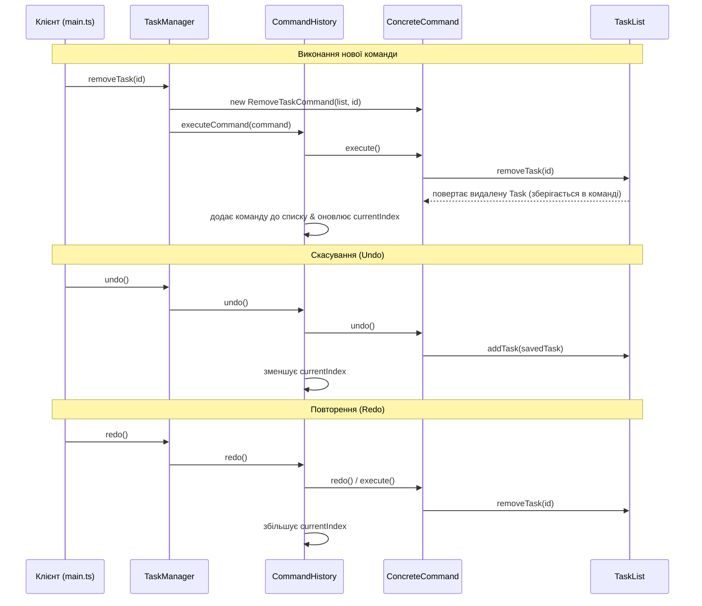

# TODO-застосунок на основі патерну Команда (Command Pattern)

Цей проєкт демонструє реалізацію консольного TODO-застосунку з підтримкою операцій додавання, видалення, оновлення та позначення виконання задач, а також керування історією змін (`undo`/`redo`) за допомогою патерну проектування **Команда (Command)**.

---

## Як працює механізм undo/redo

Механізм `undo/redo` побудований на збереженні стану або зворотних операцій всередині об'єктів команд.



- **Undo**: Коли користувач викликає `undo()`, `CommandHistory` бере команду за поточним індексом `currentIndex`, викликає її метод `undo()`, і переміщує покажчик ліворуч (`currentIndex--`).
- **Redo**: Коли користувач викликає `redo()`, `CommandHistory` переміщує покажчик праворуч (`currentIndex++`) і викликає `redo()` (який виконує `execute()`) для команди під цим індексом.
- **Нова дія після Undo**: Якщо користувач виконав декілька `undo`, а потім створив нову команду, вся історія команд після `currentIndex` видаляється (`commands.splice(currentIndex + 1)`), і нова команда додається в кінець оновленого списку.

---

## Як запустити проєкт

### 1. Передумови
Переконайтеся, що на вашому комп'ютері встановлено **Node.js** (версії 14 або новішої).

### 2. Встановлення залежностей
Якщо ви завантажили проєкт, спочатку встановіть необхідні залежності:
```bash
npm install
```

### 3. Запуск демонстраційного сценарію
Запустіть демонстраційний файл за допомогою `ts-node`:
```bash
npx ts-node ./src/main.ts
```

Після запуску ви побачите детальні консольні виводи, які демонструють послідовне виконання команд додавання, оновлення, завершення, видалення, а потім повну чергу скасувань (`undo`) та відновлень (`redo`), що підтверджують коректність роботи патерну.